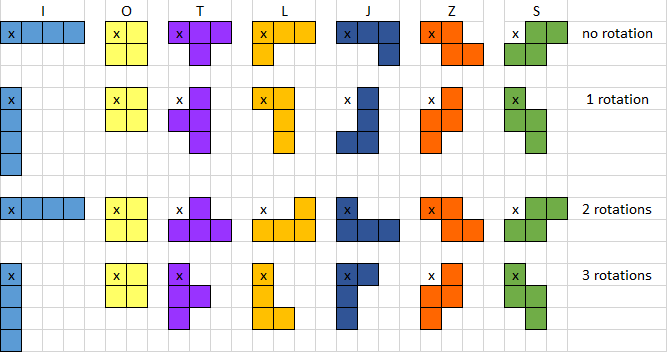

# Kapitel 18.1: Anchors – Einführung

Die letzte noch ausstehende Aufgabe, um ein voll funktionales Tetris zu haben, ist das Drehen der Combos. Um die
Komplexität zu reduzieren, verwendet man hier am besten einen sogenannten Anchor (Anker), an dem man sich orientieren
kann. Im folgenden Bild ist der Anker für die Drehung (Rotation) der Tetris-Combos mit einem x gekennzeichnet:

Der Anker 

* hat eine feste Position und verändert sich beim Drehen nicht
* ist für den Benutzer unsichtbar
* macht alle anderen Bewegungen der Tetris-Combos mit
