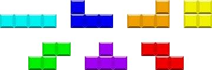

# Kapitel 16.1: Combos – Einführung

## Tetris

Dieses Mal fangen wir nicht mit etwas Neuem an, sondern machen weiter mit dem, was wir schon können. Normalerweise
fallen in Tetris nicht einzelne Blöcke. Es gibt gewöhnlich 7 verschiedene Tetris-Formen:

Die Formen werden nach ihrer Form, die Buchstaben ähneln, benannt:

Obere Reihe:  I, J, L, O

Untere Reihe; S, T, Z

Am obigen Bild kann man erkennen, dass eine Form aus 4 Blöcken besteht, die in einer bestimmten Art und Weise zueinander
angeordnet sind.

Einzelnen Blöcke fallen lassen können wir schon, jetzt müssen wir "nur" noch dafür sorgen, dass immer eine Gruppe von
Blöcken zusammen fällt. Diese Gruppe von Blöcken nennen wir nach ihren Buchstaben: **Combo_I**, **Combo_L**, ... **Combo_Z**.

Teilt euch in 7 Gruppen auf, sodass jede Gruppe eine dieser Combos implementiert. Wenn ihr fertig seid, könnt ihr die
Combos einfach austauschen – wir werden sie nämlich in Klassen implementieren!

## Klasse Block umbauen

* Die Klasse `Block` bestimmt ihre Attribute `x`, `y` und `color` jetzt nicht mehr selbst (und zufällig), sondern
  bekommt sie beim Erzeugen in der `__init__`-Methode übergeben.
* Passe die Erzeugung des aktiven Blocks (Klasse Board) entsprechend an. Für die normalerweise zufällig erzeugten Werte
  nimmst du vorläufig mal x = 160 und die Farbe deiner Combo.
* Passe auch die Erzeugung der unsichtbaren Begrenzungsblöcke an.

## Klasse Combo_x (also Combo_I, Combo_S, usw. )

Die jeweilige Klasse hat:

* folgende **Attribute**:

  * `color`        → Farbe der Combo (siehe Bild oben)
  * `x, y`         → Punkt, der die obere linke Ecke einer Hitbox dieser Combo markiert
  * `max_x, max_y` → Höhe und Breite des Fensters
  * `blocks`       → Liste der Blöcke, die zu dieser Combo gehören

* folgenden **Methoden**:

  * `create_blocks` → Erzeugt die 4 Blöcke relativ zu `self.x` und `self.y` (Aufruf in `__init__`).
  * `draw`          → Zeichnet alle Blöcke.
  * `is_active`     → liefert `True`, wenn alle Blöcke `True` sind, sonst `False`.
  * `move_left`     → Bewegt alle Blöcke nach links, aber nur, wenn sich auch alle Blöcke schieben lassen.
  * `move_right`    → Bewegt alle Blöcke nach rechts, aber nur, wenn sich auch alle Blöcke schieben lassen.
  * `drop`          → lässt alle Blöcke nach unten fallen, aber nur, wenn auch alle Blöcke fallen können.
  * `get_y`         → liefert den kleinsten y-Wert aller Blöcke zurück.
  * `get_blocks`    → liefert die Liste der Blöcke zurück.

* Passe die Klasse Board so an, dass sie statt des `active_block` eine `active_combo` verwendet.
* Wenn die aktive Combo inaktiv wird, wenn also mindestens 1 Block der Combo auf dem Boden oder einem bereits inaktiven
  Block landet, dann werden die Blöcke der Combo zu der Liste der inaktiven Blöcke zugefügt. Als Blöcke – nicht als
  Combo!
* Die Liste der inaktiven Blöcke bleibt also eine Liste von einzelnen Blöcken!
* Damit man die einzelnen Blöcke besser erkennen kann, kannst du einen grauen Rahmen um jeden Block zeichnen.

## Zufällige Startposition der Combo

Sorge jetzt dafür, dass die Combo eine zufällige Start-Position (x-Wert) hat. Wie vorher bei den Blöcken, muss dabei
aber Folgendes beachtet werden:

* Mögliche Startpositionen sind im Abstand `block_size` zu wählen.
* Alle Blöcke der Combo müssen in das Spielfeld passen.
* Der y-Wert der Startpostion bleibt fix.

## Alle Combos einbinden

Tauscht jetzt die Combos mit den anderen Gruppen aus, sodass jeder 7 Combo-Klassen hat.

Wenn eine neue Combo erzeugt werden soll, dann wählt zufällig eine der 7 Combo-Klassen aus.

## Vergleicht die Methoden der 7 unterschiedlichen Combo-Klassen

* Was ist gleich?
* Welche sind so ähnlich, dass man sie austauschen könnte, ohne die Funktionalität zu ändern?
* Wo gibt es echte funktionale Unterschiede?
